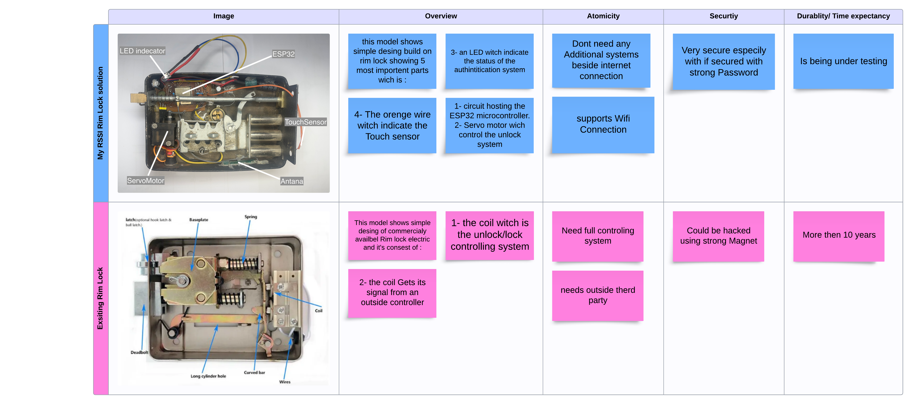

# Smart Door Locking Security System Using RSSI

ESP32 firmware for a proximity-aware rim lock: a phone joins the lock’s Wi-Fi access point, RSSI decides whether the user is close enough, and a capacitive touch pad then drives a servo to unlatch the door.

This repo is the embedded side of **Mo7aI**’s entry for the **Huawei Developer Competition** (Internet of Things and security). The project reached the **finals**. It did not win; the firmware and hardware notes here are the working prototype from that run.

**Keywords:** smart lock, RSSI, IoT security, proximity detection, ESP32, ESP-IDF, FreeRTOS

## Why RSSI instead of a key or an app tap

Received Signal Strength Indicator (RSSI) is used as a rough distance proxy. After the user connects to the ESP32 hotspot with a password, the firmware samples station RSSI. If the strongest connected device is above the threshold (about **−65 dBm**), the lock **arms** the touch unlock path. If everyone walks away or disconnects, the servo stays closed and the status LED turns off.

The idea is to skip physical keys, PIN pads, and biometric scans for everyday entry, while still requiring both **being nearby** and **touching the sensor**. That is useful in shared spaces where you want less contact and no extra app step once you are already on the lock’s Wi-Fi.

## How a visit works

1. Connect to the ESP32 hotspot (`Test3` by default; change this before you deploy).
2. Walk close enough that RSSI stays above the threshold. The LED on GPIO 21 turns on.
3. Touch the pad (TOUCH3 / GPIO 15). If the door is armed, the SG90 servo on GPIO 19 opens, then closes again.
4. Optionally open the onboard HTTP page (`http://192.168.4.1/`) to set a new AP password. It is stored in NVS and applied after reboot.

GPIO 16 is a factory-reset style button: a press erases NVS and restarts the chip.

## Hardware (prototype)

The competition comparison board is in `docs/hardware-comparison.png`. The RSSI lock is a **simple rim-lock conversion**, not a commercial deadbolt:

| Part | Role |
| --- | --- |
| ESP32 | SoftAP, RSSI polling, HTTP, touch, PWM |
| SG90 servo | Mechanical unlock / lock |
| Touch sensor | User intent after proximity is OK |
| LED | Armed / nearby indicator |
| Antenna | Wi-Fi range |

**Firmware pin map (ESP32):**

| Function | GPIO |
| --- | --- |
| Servo PWM | 19 |
| Status LED | 21 |
| Reset button | 16 |
| Touch pad | TOUCH_PAD_NUM3 (GPIO 15) |

Power, mechanical mounting, and a strong AP password are still your responsibility. RSSI is not a cryptographic proof of identity; it only estimates closeness of stations that already authenticated to the AP.



## What this repository contains

| Path | What it is |
| --- | --- |
| `main/hello_world_main.c` | SoftAP, RSSI task, servo, touch, password web UI |
| `sdkconfig` | ESP32 / ESP-IDF project config used for the prototype |
| `docs/` | Diagram used in the competition write-up |
| `huewi/` | Original Huawei materials: slides, photos, and demo video (large files are gitignored; keep them locally) |

Cloud pieces from the pitch (Huawei **ECS**, **RDS**, Django, MySQL, remote admin grant) are **not** in this tree. The firmware here is the local lock: hotspot, RSSI gate, touch, servo, and a small password page branded “Bouzid AL-Bagdadi WebServer” in the HTML.

## Demo media

On your machine, after clone, you should still have:

- `huewi/Demo_2.mp4` — main demo
- `huewi/Demo_2.mov` — same capture, larger
- `huewi/Presentation_HuaweiDeveloperCompetition_RSSIproject.pptx.pptx` — competition deck (architecture, Huawei Cloud roles, future voice / face ideas)

Those files are listed in `.gitignore` so a GitHub push stays under size limits. After you create the repo, attach `Demo_2.mp4` to a **GitHub Release** and paste the release URL here if you want the demo playable on the repo page.

## Build and flash

You need [ESP-IDF](https://docs.espressif.com/projects/esp-idf/en/latest/esp32/get-started/) with the environment sourced (`get_idf` / `export.sh`). Target is **ESP32**.

```bash
idf.py set-target esp32
idf.py build
idf.py -p /dev/ttyUSB0 flash monitor   # macOS: /dev/cu.usbserial-*
```

Change `EXAMPLE_ESP_WIFI_SSID` and `EXAMPLE_ESP_WIFI_PASS` in `main/hello_world_main.c` before flashing anything that leaves your desk. The firmware also reboots on a long timer (about six hours).

## Competition architecture (from the deck)

The slides described a wider system than this firmware:

- **ESP32** — on-door hotspot, RSSI, actuators
- **Huawei ECS** — Django app: logs, remote permission, admin view
- **Huawei RDS / MySQL** — access events

**Intended user flows**

1. **Standard access:** join hotspot → in range → touch → unlock; log timestamp / device to the cloud when that backend is present.
2. **Admin / guest:** remote grant from the cloud after an out-of-band request (for example a phone call), plus monitoring of entry times.

**Design notes from the pitch:** encrypt device–cloud traffic, keep the lock modular (extra sensors later), store logs off-device so a brick does not wipe the audit trail.

## Future ideas (slides)

Voice recognition and face detection were listed as next steps, not implemented in this firmware.

## License

The ESP-IDF example header in `main/hello_world_main.c` marks that file as public domain / CC0. If you publish this as your own product, add a top-level `LICENSE` you are comfortable with and replace the default Wi-Fi credentials.
